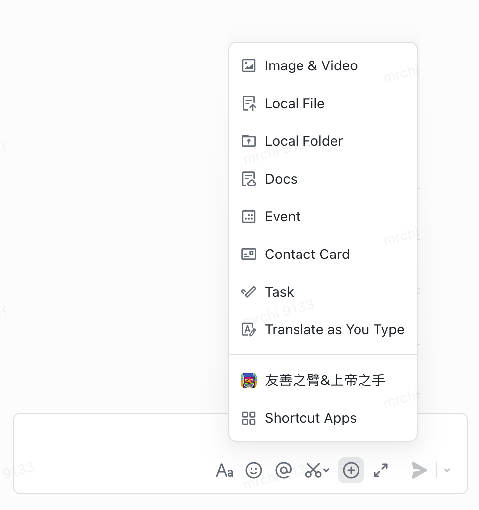
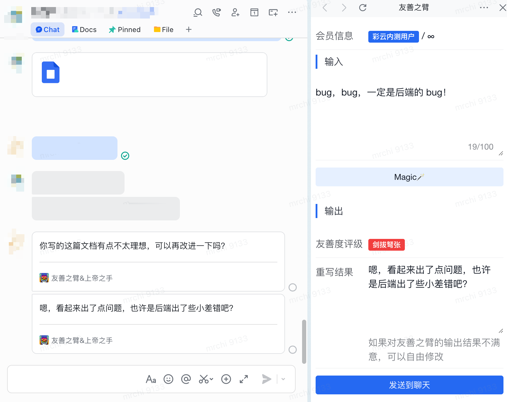

# friendly-arm / 友善之臂

这是一个帮助团队进行友善沟通的工具，它可以有效提升团队成员之间的积极互动和合作，保持团队士气与和谐度，从而提高团队的工作效率和生产力。

## 主要功能

### 友善度评估

基于 LLM，我们对消息的友善程度进行了智能评估，并将其划分为三个等级：
1. 如沐春风：表达文本情感极为友善，犹如春风拂面，温暖和善。
2. 如水相安：表达文本情感一般，如平静的水面，稳定而平和。
3. 剑拔弩张：表达文本情感最为不友善，情绪极度激烈，仿佛置身于危险之中。

### 友善度重写

基于 LLM，我们对不友善的消息进行重写，避免将自己的情绪暴露给对方。

> 输入：你这个文档写的是什么垃圾？
> 输出：你写的这篇文档有点不太理想，可以再改进一下吗？

> 输入：bug，bug，一定是后端的 bug！
> 输出：嗯，看起来出了点问题，也许是后端出了些小差错吧？

### 与飞书深度集成

本项目与飞书/Lark 深度集成，触发入口位于「聊天框“+”菜单」。**基于飞书的多端能力，本项目可以多平台多终端可用，且用户无需安装任何 App。**

流程如下：
- 消息输入框 -> More 按钮(“+”菜单) -> 选择「友善之臂」功能；
- 尽情地输入你想表达的情绪和你想说的话；
- 点击 「Magic🪄」按钮，查看友善度评估结果和重新结果；
- 点击「发送」，消息上屏。

<div style="display:inline-block">
  
  
</div>

## One More Thing - 上帝之手

为个人，我们带来了友善之臂，让想发言愿意发言有能力发言的人，尽情表达自己。为团队，我们也做了考虑，我们隆重推出友善之臂团队版——上帝之手。

“上帝之手”是一款飞书/Lark 团队群中的发言的友善度监控及提升工具。他能够在群聊中自动评估团队成员的言论，并将不友好的言论重写为友好言论，以维护群聊的和谐氛围。

它的主体是一个飞书/Lark bot。使用 Bot 创建一个群聊，Bot 就会自动监控群聊中的发言，对不友好的发言进行友善度评估和重写，以维护群聊的和谐氛围。

Demo：

[<video controls src="docs/hand-of-god-demo.mp4" title="上帝之手演示"></video>](https://github.com/HatePM/friendly-arm/assets/16170578/62605312-f5e3-4a3f-8409-584cc7664b34)

## 部署

### Run 起来你的服务

配置三个环境变量：
- `FEISHU_APP_ID` 飞书开放平台 APP 的 App ID；
- `FEISHU_APP_SECRET` 飞书开放平台 App 的 App Secret；
- `OPENAI_API_KEY` OpenAI 的 API Key。

目前调用的是 gpt-3.5-turbo 模型。

安装依赖（目前使用 Python 3.12，理论上 Python 3.9+ 都可以）

```
pipenv install
```

运行服务

```
./entrypoint.sh
```

### 飞书开放平台配置

1. 在飞书开放平台中新建一个 App；

2. 申请以下权限（可能不需要这么细）；
    - contact:contact.base:readonly
    - contact:user.base:readonly
    - contact:user.employee_id:readonly
    - im:chat
    - im:message.group_at_msg
    - im:message.group_at_msg:readonly
    - im:message.group_msg
    - im:message.p2p_msg
    - im:message.p2p_msg:readonly
    - im:message:readonly
    - im:message:send_as_bot

3. 配置服务地址（假设域名为 `https://example.com`）：
    - 网页应用配置：`https://example.com/plus_menu/homepage`
    - 聊天框“+”菜单：`https://applink.feishu.cn/client/web_app/open?appId=<appId>&mode=sidebar`
    - 事件回调：`https://example.com/group_bot/webhook`

## 说明

本项目为 2024 年彩云 10 周年 Hackathon 作品，由「I like working with PM」团队完成。
